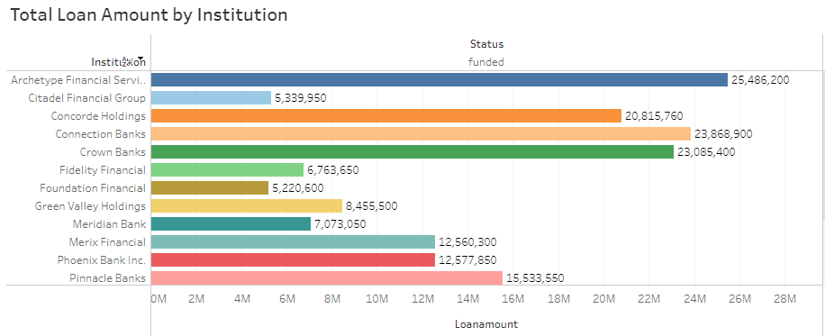
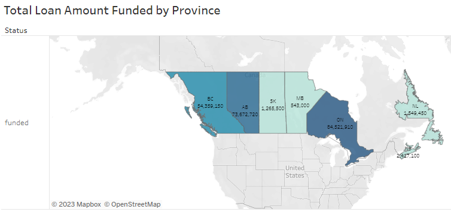
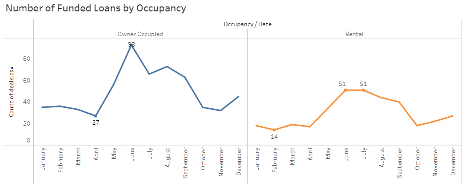

<body style="background-color:#006366;"></body>


## BANK DATA ANALYSIS PROJECT

&emsp; <font size = "2">This is simply a brief outline of the project as this particular project is company-related (and therefore proprietary). 
I've put this together by creating a relational database, running queries through SQL to gain meaningful insights and visualizing the data using Tableau. </font>

Examples of use cases: 
* <font size = "2">Outline the number of funded loans by underwriter on a monthly and yearly basis to measure output across the team to measure performance </font>
* <font size = "2">Determine the average interest rate by underwriter relative to the average rate across the entire team</font>
* <font size = "2">Rank the top 10 brokers by the number of loans funded for the year as well as the cumulative total dollar amount of funded loans to determine the bank's most productive relationships</font>
* <font size = "2">Isolate the percentage of deals declined relative to deals actioned by each underwriter to determine opportunities for coaching </font>
* <font size = "2">Measure the quality and accuracy of each underwriter based on their respective compliance scores for deals funded to determine opportunities for coaching </font>
* <font size = "2">List brokers by rate of declines relative to submissions to determine opportunities for coaching </font>

*****

## MORTGAGE BROKERAGE ANALYSIS PROJECT

## SQL Portion

&emsp; <font size = "2">As a quick synopsis, I created the below relational database for mortgage brokerage. Only mock data was used in the creation of this project. </font>


Below are quick links to the tables for reference. 

[Download link - deals raw data CSV file](./deals.csv)   
[Download link - brokers raw data CSV file](./brokers.csv)       
[Download link - institutions raw data CSV file](./institution.csv)  
[Download link - clients raw data CSV file](./clients.csv)    

## <font size = "2"> Using joins and aggregate functions </font>
In this example, I ran the below query to list the top 10 brokers by total deals (includes all funded, approved, declined and cancelled deals).

```sql
SELECT 
    name, COUNT(*) AS totaldeals
FROM
    brokers
        JOIN
    deals ON brokers.id = deals.brokerid
GROUP BY name
ORDER BY totaldeals DESC LIMIT 10;
```


The below query quantifies the grand total of funded loans per province and orders them from lowest to highest.

## <font size = "2"> Aggregate functions ft. the WHERE clause </font>
```sql
SELECT 
    SUM(loanamount) AS totalfunded, province
FROM
    deals
WHERE
    status = 'funded'
GROUP BY province
ORDER BY totalfunded ASC;
```


## <font size = "2"> Window functions ft. PARTITON BY clause </font>

```sql
SELECT DISTINCT 
	name,
    COUNT(*) OVER(PARTITION BY name) AS dealsperbroker 
FROM deals 
JOIN brokers 
ON deals.brokerid = brokers.id;
```


## <font size = "2"> Subqueries </font>

```sql
SELECT 
    brokerid, loanamount, city, rate
FROM
    deals
WHERE
    loanamount = (SELECT 
            MAX(loanamount)
        FROM
            deals);
```


## <font size = "2"> Case statements </font>

```sql
SELECT name, cbscore,
CASE
WHEN cbscore < 559 THEN 'poor'
WHEN cbscore BETWEEN 560 AND 659 THEN 'fair'
WHEN cbscore BETWEEN 660 AND 724 THEN 'good'
WHEN cbscore BETWEEN 725 AND 759 THEN 'very good'
ELSE 'excellent'
END AS cbranges FROM clients
JOIN deals ON clients.id = deals.clientid;
```


## Data Visualization

The below visualizations were created on Tableau using the same relational database used above.

They can also be viewed directly on my Tableau Public following [this](https://public.tableau.com/views/Portfolio-p-bianca/Dashboard1?:language=en-US&:display_count=n&:origin=viz_share_link) link.


&nbsp;

&nbsp;

&nbsp;



<font size = "2"></font>

****


[back](./)


